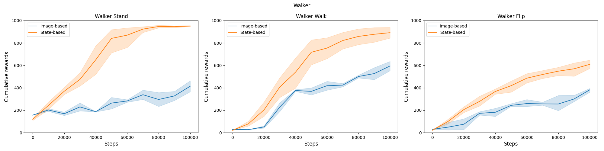

# BeCL for Image-based observation

This code evaluates the performances of BeCL in imaged-based observation of URLB.  This codebase is built on top of the [Unsupervised Reinforcement Learning Benchmark (URLB) codebase](https://github.com/rll-research/url_benchmark) and follows its requirement. 

Overall, to extend BeCL to image-based DMC tasks, we refer to the PIEG algorithm to embed imaged observation into features using an additional network including Resnet. Specifically, we add its encoder to embed the observation before updating our policy and reward in the pretraining and fine-tuning stage. More introduction to the design of the image encoder can be found in (PIEG): [Pre-Trained Image Encoder for Generalizable Visual Reinforcement Learning](https://arxiv.org/abs/2212.08860).  These encoders are implemented in `\agent`.  

We give the qualitative results of the imaged-based and state-based performance of BeCL in different downstream walker tasks in URLB:



The result shows that the performance in image-based tasks still underperforms that in state-based tasks.

To test the experiment, run the following command to pre-train the state encoder:

``` sh
#Image-based BeCL
python pretrain.py agent=becl_with_resnet domain=walker seed=3 obs_type=pixels action_repeat=2

#state-based BeCL
python pretrain.py agent=becl domain=walker seed=3
```

For testing the performance of different state encoders in downstream tasks, run the following command to fine-tune policies:

```sh
#Image-based BeCL
python finetune.py task=walker_stand obs_type=states agent=becl_with_resnet reward_free=false seed=3 domain=walker snapshot_ts=2000000 obs_type=pixels action_repeat=2

#Image-based BeCL
python finetune.py task=walker_stand obs_type=states agent=becl reward_free=false seed=3 domain=walker snapshot_ts=2000000
```

This will load a snapshot stored in `./models/{obs_type}/walker/becl/3/snapshot_2000000.pt`, initialize `DDPG` with it (both the actor and critic),  and start training on `quadruped_stand` using the extrinsic reward of the task. 

